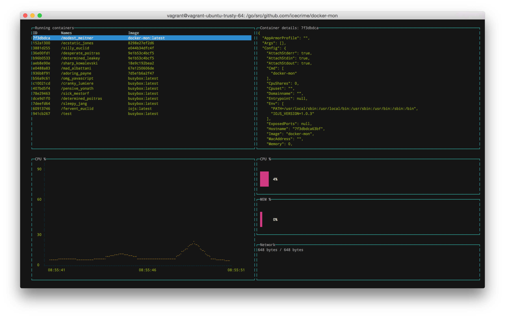

Docker-mon
----------

Console-based Docker monitoring based on [blessed-contrib](https://github.com/yaronn/blessed-contrib).

# Usage

    $ docker build -t docker-mon . && docker run --rm -ti -v /var/run/docker.sock:/var/run/docker.sock docker-mon

# Screenshots

